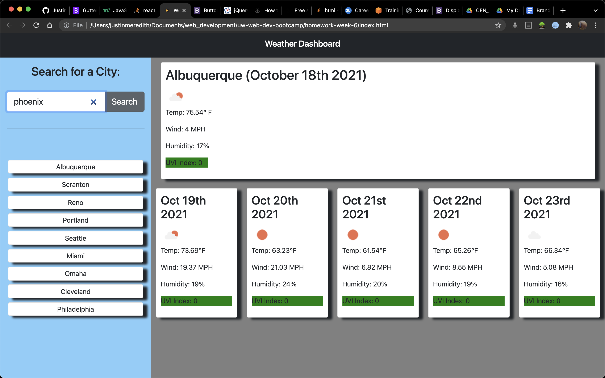

## Weather Dashboard

### Functionality

This is a weather dashboard app where the user can look up the weather for most major cities in the world. 
The user can enter a city into the search field and either click the 'Search' button or hit enter.
Weather information for the desired city is displayed to the right of the search field.

At the top of the display area, the current weather information is displayed. It shows the name of the city, the date, 
an icon showing current weather conditions, current temperature, wind speed, humidity, and the UV index.

Below that is a forecast for the next five days, showing the date, an icon displaying weather conditions, the temperature, 
wind speed, humidity, and UVI index for that day.

After a city has been entered, it is prepended into a search history displayed below the search field. Any city in the search history can be clicked on and its data will be displayed. This information is stored in local storage. 

### Technologies Used
  -Javascript
  -jQuery
  -HTML
  -CSS

### Screenshot

Here are two screenshots of the dashboard: 

### Deployed Version

Here is a link to a deployed version of the site:

https://justinm099.github.io/weather-dashboard/

### Contact

Please feel free to contact me if you have questions! justinm099@mac.com
